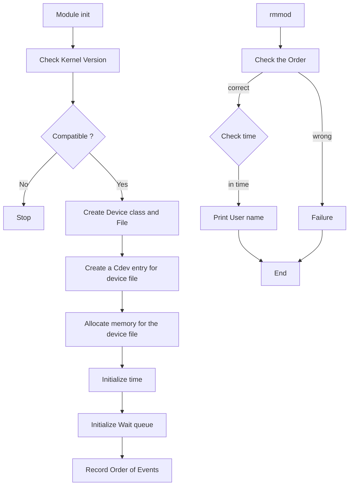

# S5_OS_Assignment_2
## Introduction
The assignment required the development of a Character Device Driver with specific functionalities. This report details the methodology, explanation, implementation, and outcomes of the assignment.
## Usage
1. **Open a Terminal:**
	
	- Open a terminal window on your Linux system.
2. **Navigate to the Module Source Code Directory:**
	
	- Use the `cd` command to navigate to the directory containing your kernel module source code (where the Makefile is located).
	```bash
	cd /path/to/your/module/source/code
	```
	
3. **Run the Make Command:**
	
	- Run the `make` command to build the kernel module. This will invoke the instructions in the Makefile.
	```bash
	make
	```
	
	This command tells `make` to build the module by executing the instructions specified in the Makefile. The `-C` option specifies the directory where the kernel headers are located (`$(KDIR)`), and `M=$(shell pwd)` specifies the current directory as the location of the module source code.
	
4. **Check for Compilation Success:**
	
	- After running the `make` command, check the terminal for any compilation errors. If the compilation is successful, you should see the generation of the `cdd_module.ko` file.
5. **Load the Kernel Module:**
	
	- Once the module is successfully compiled, use the `insmod` command to load the module into the kernel. Replace `/path/to/cdd_module.ko` with the actual path to your compiled module.
	
	```bash
	sudo insmod /path/to/cdd_module.ko kernel_version=5,2 time=30
	```
	
	This command loads the module with specific parameters (`kernel_version` and `time`) required by your driver.
	
6. **Check `dmesg` for Output:**
	
	- Use the `dmesg` command to check the kernel messages for any output or information printed by your kernel module.
	```bash
	dmesg
	```
	
	Look for the output related to your module, including major number, minor number, and time value.
	
7. **Perform Driver Actions:**
	
	- After loading the module, perform the actions described in your driver (e.g., reading from the device, getting the username, etc.).
	
	Reading :
	```bash
	cat /dev/cdd_device
	```
	Writing :
	```bash
	echo "$USER  " > /dev/cdd_device
	```
1. **Unload the Kernel Module:**
	
	- When you are done testing, use the `rmmod` command to unload the kernel module.
	```bash
	sudo rmmod cdd_module
	```
	
	This command unloads the `cdd_module` from the kernel.
	
9. **Check `dmesg` Again:**
	
	- Check the `dmesg` command again to see the output related to unloading the module.
	- To get only the last few lines we can use `tail` command for last `x` lines
	```bash
	dmesg | tail -x
	```

These steps assume that your kernel module source code is correctly written and that there are no compilation errors. Always check the terminal and `dmesg` for any error messages or debugging output during these steps.

This driver creates a character device, reads and writes data, uses a time, and coordinates events through a wait queue and kernel thread for orderly execution within a specified time.

## Flow of the Code


